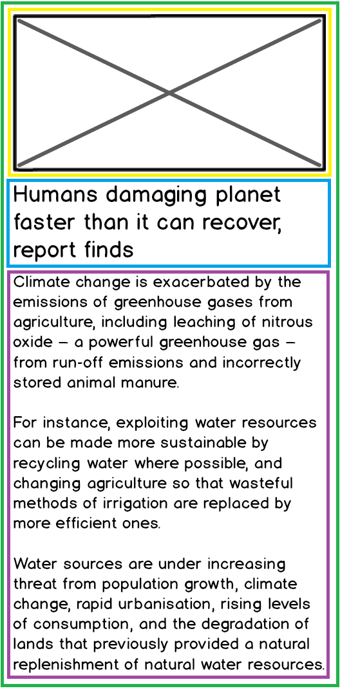
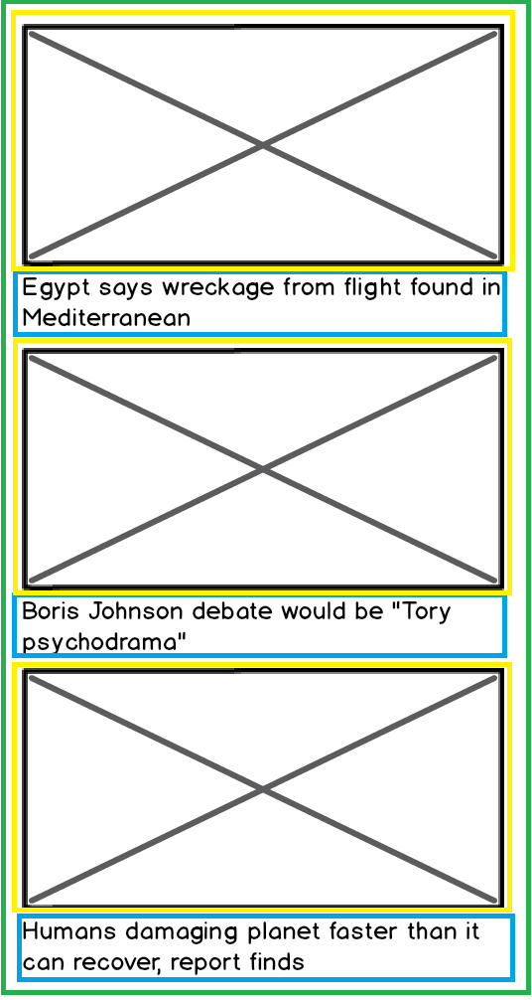

For my challenge I started identifing the hierarchy 

my components:
Headline => where all the news are
Display article
Article Summary
Article Details
Header 
Footer




green - Article Page
yellow - image
blue - Headline Title
purple - Body Text



Green - Whole page
yellow - images
blue - Healine Title 


### Logic of my code 

I then started creating everything static, using the API key to display the image and headline title.

I tried testing, but i couldnt work it out, so I focused on the criterias and making my code work properly.


I installed axios and got it working, but had to copy the lines 20-23 to my ArticleDetails component as I keep getting an error when trying other ways.

Once I got the standart criterias working, I made a copy of my project, so I could work on it, and in case something went wrong I still have the standart ones safe.

Once I got all my routes working I then started working on displaying contents where they should display.

I used props to pass information in my components and added classNames so I could style it later.

I then added Links and managed to get it working, but the Single item API for some reason wasnt working, I tried many ways, and I then asked Hugo's help as this was after 5 on friday. He helped me with the Link and I could see my single article passing ID and APP_KEY on the Link.

I tried writing some tests again and decided not to try anymore as I couldnt make them pass, I dont know if my logic was right, but I wrote down a few things to test:

I would test my Header and Footer, using getByTestId or toHaveTextContent, I even added on my component data-testid="header" and data-testid="footer", I left it on my code, as I would love to go back and try the test again. Hopefully it passes.

I would test if it renders the title and i would also write a test to see if render the details properly.

I installed Bootstrap, but I know little about it, so I decided to style using CSS, I add an animation on my Header and I quite like the result of it all. I could style it better but as it was looking good, not a high school project I decided to keep it that way and call it a day .

I will go back to check the tests and try to learn how to make them work.

------------------------


# News Summary Challenge

### Task

You'll test-drive a single page application in React that send requests to the Guardian API to get Headline and Article data and to the Aylien API to summarise text. 

### Serving your app

You'll use React's toolchain to take care of serving your HTML, CSS and JavaScript files.  

## User Stories

Some of these stories will need decomposing if they seem too large.

### Standard
```
As a busy politician
So I know what the big stories of the day are
I can see all of today's headlines in one place
```

```
As a busy politician
So that I have something nice to look at
I can see a relevant picture to illustrate each news article when I browse headlines
```

### Extended

```
As a busy politician
So that I can get an in depth understanding of a very important story
I can click a news headline to see a summary and a photo of the news article
```

```
As a busy politician
So I can get a few more details about an important story
I can see click a news article summary title which links to the original article
```

```
As a busy politician
Just in case my laptop breaks
I can read the site comfortably on my phone
```

```
As a busy politician
To make my news reading more fun
I can see whizzy animations in the app
```

## Mockups

### Headlines page


### Article summary page


## API

### API request rate limits and stubbing

The Guardian and Aylien text summarisation APIs are severely rate-limited.

**Please stub your tests so you don't exceed the daily limit.  Otherwise, all requests will be rejected and your app will stop working!**

### Guardian API example

**Please stub your tests to avoid exceeding the API rate limit**

If you wanted to get the content of an article from the Guardian API, this is the cURL request you might make.  Notice how it has a query parameter for `api-key`.

```sh
# Search endpoint
curl "https://content.guardianapis.com/search?q=coronavirus&show-fields=body&api-key=API_KEY"
```
```sh
# Single Item endpoint
curl "https://content.guardianapis.com/world/2021/mar/22/link-between-diabetes-and-coronavirus-infections?show-fields=body&api-key=API_KEY"
```

#### Example request data

[Mock Data](./mockNewsData.json) - contains a request to the Guardian API with fields selected that will help you with the challenge.  The actual request made was to:

https://content.guardianapis.com/search?order-by=newest&show-fields=byline%2Cthumbnail%2Cheadline%2CbodyText&api-key=INSERT_YOUR_KEY_HERE

You will need to replace `INSERT_YOUR_KEY_HERE` with your own Guardian API key.  Use this data whilst developing, serving it from `json-server` - it will help on the request rate limit in the API.

### Aylien text summarisation API example

**Please stub your tests to avoid exceeding the API rate limit**

If you wanted to use the Aylien API to summarise an article by Bret Victor, this is the cURL request you might make.  Notice how it has headers to authenticate with the Aylien API.

```
curl "https://api.aylien.com/api/v1/summarize?url=http://worrydream.com/MediaForThinkingTheUnthinkable/note.html" \
  -H "X-AYLIEN-TextAPI-Application-ID: APPLICATION_ID" \
  -H "X-AYLIEN-TextAPI-Application-Key: SECRET_APPLICATION_KEY"
```

## Resources

* [Guardian newspaper API homepage](http://open-platform.theguardian.com/documentation/)
* [Aylien text summary API docs](http://docs.aylien.com/docs/summarize)
* cURL [man page](https://curl.haxx.se/docs/manpage.html)
* [Hurl](https://www.hurl.it/), a web interface for sending HTTP requests

---

# Getting Started with Create React App

This project was bootstrapped with [Create React App](https://github.com/facebook/create-react-app).

## Available Scripts

In the project directory, you can run:

### `npm start`

Runs the app in the development mode.\
Open [http://localhost:3000](http://localhost:3000) to view it in the browser.

The page will reload if you make edits.\
You will also see any lint errors in the console.

### `npm test`

Launches the test runner in the interactive watch mode.\
See the section about [running tests](https://facebook.github.io/create-react-app/docs/running-tests) for more information.

### `npm run build`

Builds the app for production to the `build` folder.\
It correctly bundles React in production mode and optimizes the build for the best performance.

The build is minified and the filenames include the hashes.\
Your app is ready to be deployed!

See the section about [deployment](https://facebook.github.io/create-react-app/docs/deployment) for more information.


